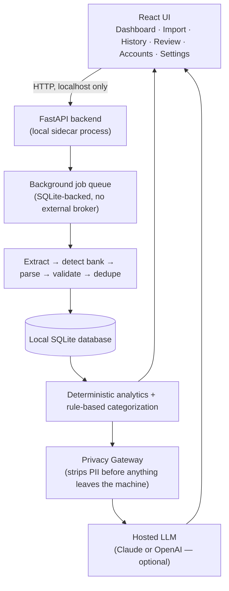

# Bank Statement Analyzer

[](https://github.com/kervcodes/Bank-Statement-Analyzer/actions/workflows/ci.yml) [](#testing) [](https://github.com/astral-sh/ruff) [](#license)

[](https://www.python.org/) [](https://fastapi.tiangolo.com/) [](https://www.sqlite.org/) [](https://www.electronjs.org/) [](https://react.dev/) [](https://www.typescriptlang.org/) [](https://tailwindcss.com/) [](https://vitejs.dev/) [](https://pnpm.io/)

A local-first desktop app that reads your PDF bank and credit card statements and turns them into
a dashboard: cash flow, spending by category, recurring charges, merchant trends, and an optional
plain-English AI summary. **The numbers are always computed deterministically — the AI only
explains them, never calculates them.**

Runs entirely on your machine. No server, no account, no data leaves your computer except
sanitized, PII-stripped facts sent to an LLM *you* configure for the explanation layer — and even
that is optional.

## What it does

- Accepts PDF statements from multiple banks and credit cards (Chase, Citizens, Capital One, Santander, Citi, Best Buy, Home Depot, and more).
- Extracts transactions from native PDF text, falling back to OCR only when needed.
- Detects the source bank/format automatically and parses it with a bank-specific parser.
- Validates every statement's numbers against its own reported balances before trusting them.
- Deduplicates overlapping statements and transactions — never silently deletes a real one.
- Computes cash flow, spending, recurring charges, and trends, then optionally asks Claude or OpenAI to explain the results in plain English.
- Deletes raw PDFs after processing by default; the extracted data stays traceable back to its source.

Full spec: [`requirements.md`](./requirements.md).

## How it works



Full reasoning behind these choices (why async processing, why a canonical schema, why the LLM
never touches raw numbers) lives in [`techstack.md`](./techstack.md).

## Getting started

Prerequisites: Node 20+ with `pnpm`, and Python 3.12+ with [`uv`](https://docs.astral.sh/uv/).

```bash
# From apps/desktop — starts Vite, Electron, and the backend together
pnpm install
pnpm dev
```

To run either half on its own while iterating:

```bash
# Backend (from apps/backend)
uv sync
uv run uvicorn app.main:app --port 8420 --reload

# Frontend (from apps/desktop, separate terminal)
pnpm install
pnpm dev
```

## Testing

```bash
cd apps/backend
uv run pytest       # fails if coverage drops below 90% (apps/backend/pyproject.toml)
uv run ruff check .
uv run ruff format --check .
```

A local pre-push hook runs the same suite (opt-in per clone: `git config core.hooksPath
.githooks`). CI (`.github/workflows/ci.yml`) runs the same checks on every PR against `main`,
which is branch-protected to require that check before merging.

## Project structure

```
bank-statements-analyzer/
├── apps/
│   ├── desktop/       # Electron + React frontend
│   └── backend/       # Python FastAPI backend (uv-managed)
├── docs/
│   └── activity.md    # Running log of work done, per CLAUDE.md
├── tasks/
│   └── todo.md        # Current plan, per CLAUDE.md's planning workflow
├── techstack.md
├── design-notes.md
├── requirements.md
├── build-plan.md
└── CLAUDE.md
```

Full rationale for this layout: `techstack.md` section 17.

## Docs in this repo

| File | What's in it |
|---|---|
| [`techstack.md`](./techstack.md) | The concrete stack and every technology decision, with reasoning. |
| [`design-notes.md`](./design-notes.md) | Screen-by-screen UI/UX spec: navigation, wireframes, visual style. |
| [`requirements.md`](./requirements.md) | The testable requirement list (REQ-IDs) and the v1 definition of done. |
| [`build-plan.md`](./build-plan.md) | The build prompts used with Claude Code, in dependency order. |
| [`CLAUDE.md`](./CLAUDE.md) | Coding conventions: planning workflow, Python/uv setup, testing, git branching. |
| [`docs/activity.md`](./docs/activity.md) | Running log of what was actually built, when, and what broke. |
| [Build log](https://kervintznoel.com/posts/build-log-1-a-window-that-says-ok) | The public write-up of each milestone, for people rather than tooling. |

## Current status

The full pipeline runs end to end — intake, extraction, parsing, validation, deduplication,
analytics, categorization, and the Electron/React frontend (Dashboard, Import, History, Review,
Accounts, Settings) are all built and tested. Packaging (build-plan #10) is next.

Blow-by-blow history, including every decision and why: [`docs/activity.md`](./docs/activity.md).
The same story written for humans rather than tooling: [build log](https://kervintznoel.com/posts/build-log-1-a-window-that-says-ok).

## Contributing / conventions

Solo project for now. Coding conventions, the plan-then-approve workflow, and testing/branching
rules are defined in [`CLAUDE.md`](./CLAUDE.md) — read that before making changes.

## License

Not yet decided — there's a plan to eventually charge a one-time fee for this app (see
`techstack.md` section 19), so this is not currently open source.
