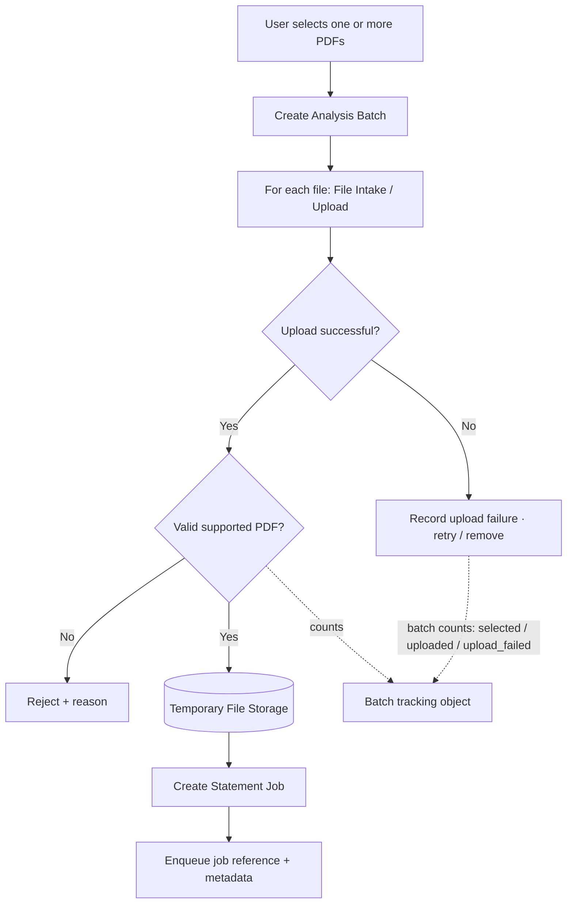
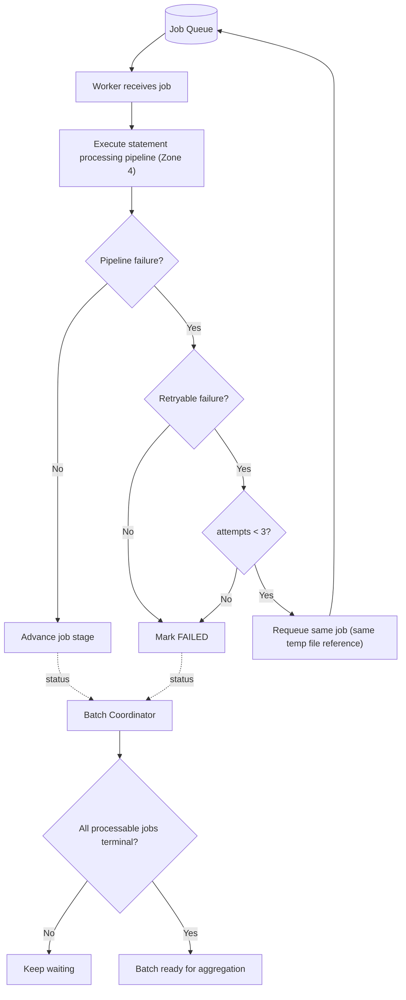
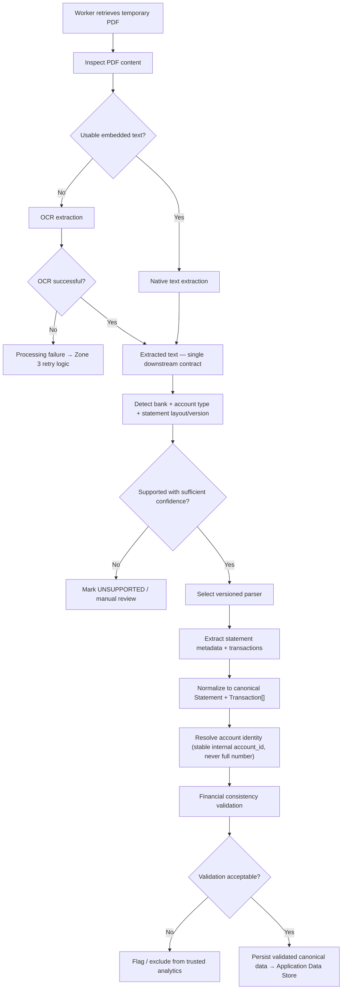
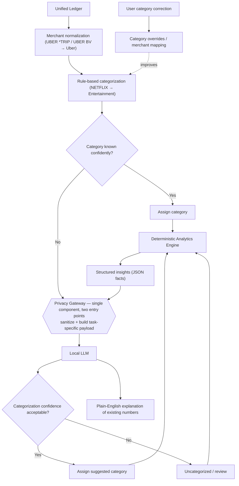
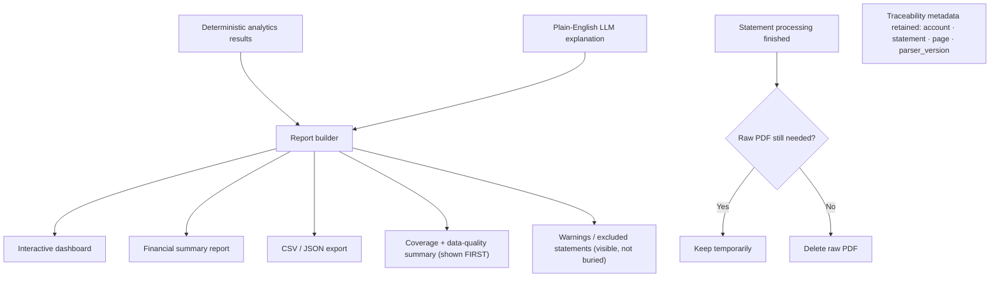
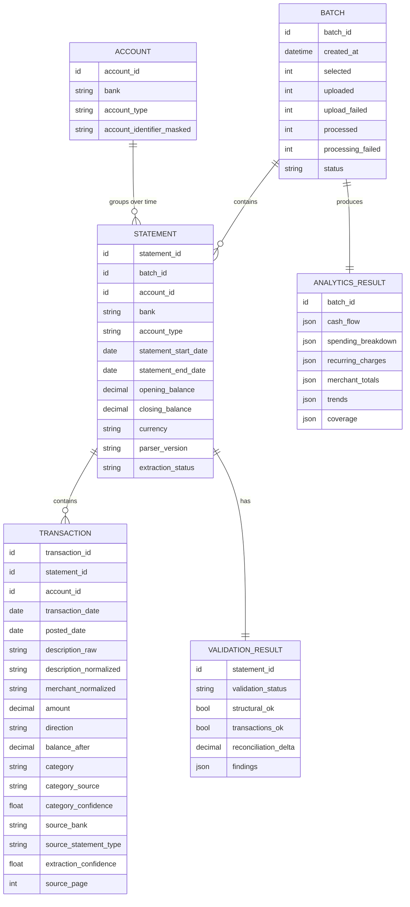
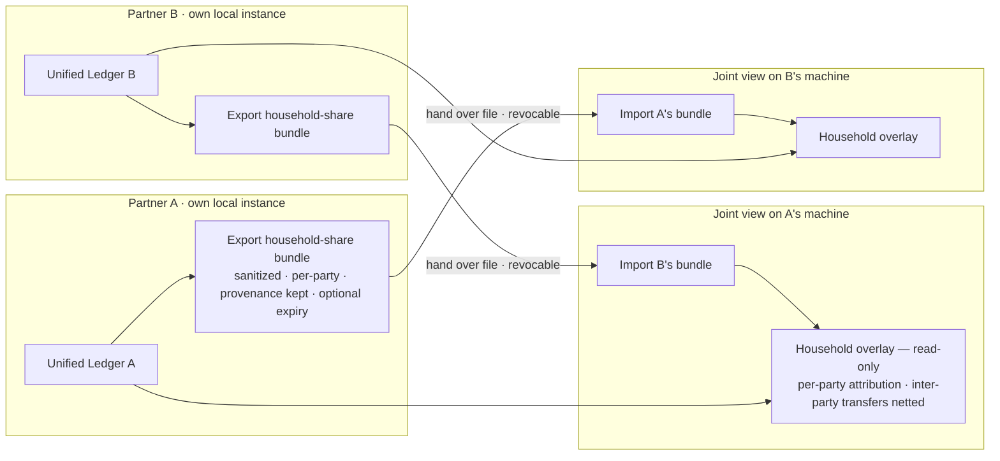

# Bank Statement Analyzer — Architecture

**Source:** `resources/Design Architecture Diagrams.pdf` (79-page design session, 2026-08-30)
**Companion docs:** [[project-spec]] · [[Design-Review-and-Scope]]
**Interactive version (HTML artifact):** <https://claude.ai/code/artifact/dded2d38-66f4-4dc9-b355-e880c15cd392> · source `architecture-diagram.html`
**Status:** Design artifact. Nothing built. Slice execution is queued behind P2 per
`Design-Review-and-Scope.md`.

This file is the visual + reference form of the design. The reasoning behind every decision
lives in the PDF; this document records *what was decided*, not the debate.

---

## 1. The seven zones

The system divides into seven zones. Data flows top to bottom. Sensitive raw data lives only
in the shaded region; the local LLM sits behind a second, tighter boundary.

```mermaid
flowchart TD
    subgraph Z1["1 · USER / CLIENT"]
        U["User selects one or more PDF bank statements"]
    end

    subgraph Z2["2 · INTAKE"]
        UP["File intake / upload"]
        DUP{"Upload succeeded?"}
        DVAL{"Valid supported PDF?"}
        TFS[("Temporary File Storage")]
        MKB["Create / attach Analysis Batch"]
        MKJ["Create Statement Job"]
        Q2["Enqueue job reference + metadata"]
    end

    subgraph Z3["3 · BACKGROUND PROCESSING"]
        QUEUE[("Job Queue")]
        WORK["Worker pool"]
        PIPE["Run statement processing pipeline"]
        DRETRY{"Failure? retryable?"}
        BC["Batch Coordinator tracks job states"]
    end

    subgraph Z4["4 · EXTRACTION + NORMALIZATION"]
        INSPECT["Inspect PDF content"]
        DTEXT{"Usable embedded text?"}
        NATIVE["Native text extraction"]
        OCR["OCR extraction (fallback)"]
        TEXT["Extracted text (single contract)"]
        DETECT["Detect bank + account type + format/version"]
        DSUP{"Supported with enough confidence?"}
        PARSE["Select versioned parser → extract statement + transactions"]
        NORM["Normalize to canonical schema"]
        ACCT["Resolve account identity"]
        FVAL["Financial consistency validation"]
        DFV{"Validation acceptable?"}
    end

    subgraph Z5["5 · TRUSTED DATA + AGGREGATION"]
        ADS[("Application Data Store")]
        DTERM{"Batch: all jobs terminal?"}
        SDD["Statement-level duplicate detection"]
        TDD["Transaction-level duplicate detection"]
        LEDGER["Unified Ledger (by account, over time)"]
    end

    subgraph Z6["6 · ENRICHMENT + ANALYTICS + AI"]
        MN["Merchant normalization"]
        CAT["Rule-based categorization"]
        DCAT{"Category known confidently?"}
        PG{{"Privacy Gateway — sanitize + task-specific payload"}}
        LLM["Local LLM"]
        ANALYTICS["Deterministic Analytics Engine — owns every number"]
        INSIGHTS["Structured financial insights"]
        EXPLAIN["Plain-English explanation"]
    end

    subgraph Z7["7 · OUTPUTS + COVERAGE + CLEANUP"]
        REPORT["Report builder"]
        OUT["Dashboard · Financial report · CSV/JSON export · Coverage & data-quality summary"]
        DCLEAN{"Raw PDF still needed?"}
        DEL["Delete raw PDF"]
    end

    U --> UP --> DUP
    DUP -- No --> UFAIL["Mark file failed · retry / remove"]
    DUP -- Yes --> DVAL
    DVAL -- No --> REJECT["Reject + explain reason"]
    DVAL -- Yes --> TFS --> MKB --> MKJ --> Q2 --> QUEUE

    QUEUE --> WORK --> PIPE --> DRETRY
    DRETRY -- "retryable & attempts < 3" --> QUEUE
    DRETRY -- "non-retryable or attempts = 3" --> FAILJ["Mark job FAILED"]
    DRETRY -- success --> INSPECT
    PIPE -. status updates .-> BC
    FAILJ -. status updates .-> BC

    INSPECT --> DTEXT
    DTEXT -- Yes --> NATIVE --> TEXT
    DTEXT -- No --> OCR --> TEXT
    TEXT --> DETECT --> DSUP
    DSUP -- No --> UNSUP["Mark UNSUPPORTED / manual review"]
    DSUP -- Yes --> PARSE --> NORM --> ACCT --> FVAL --> DFV
    DFV -- No --> FLAG["Flag / exclude from trusted analytics"]
    DFV -- Yes --> ADS

    ADS --> DTERM
    DTERM -- No --> WAIT["Wait for remaining jobs"]
    DTERM -- Yes --> SDD --> TDD --> LEDGER

    LEDGER --> MN --> CAT --> DCAT
    DCAT -- Yes --> ANALYTICS
    DCAT -- No --> PG --> LLM --> DCONF{"Confidence acceptable?"}
    DCONF -- Yes --> ANALYTICS
    DCONF -- No --> UNCAT["Uncategorized / review"] --> ANALYTICS
    ANALYTICS --> INSIGHTS --> PG
    PG --> LLM
    LLM --> EXPLAIN

    INSIGHTS --> REPORT
    EXPLAIN --> REPORT
    REPORT --> OUT
    OUT --> DCLEAN
    DCLEAN -- No --> DEL
    DCLEAN -- Yes --> KEEP["Keep temporarily"]

    BC -. "gates aggregation" .-> DTERM

    classDef sensitive fill:#fde8e8,stroke:#b91c1c,color:#111;
    classDef store fill:#e8f0fe,stroke:#1e40af,color:#111;
    class Z3,Z4,Z5,Z6 sensitive;
    class TFS,QUEUE,ADS store;
```



> **Privacy boundary (outer):** zones 3–6 plus Temporary File Storage and the Local LLM run
> inside a controlled processing environment. Sensitive financial data does not leave it.
> **Privacy boundary (inner):** every path to the Local LLM passes through the Privacy
> Gateway. Only sanitized, task-specific data crosses it. There is no direct path to the model.

---

## 2. Zone detail diagrams

### Zone 2 — Intake



Rules: upload failure and validation failure are **separate** concerns. The batch is the
top-level tracking object from the start and does **not** require every file to succeed.
Invalid files never reach the queue.

### Zone 3 — Background Processing



Retryable: worker crash, transient file-read error, OCR timeout, transient storage error.
Not retryable: corrupted PDF, password-protected, unsupported format, consistently unusable
OCR. Max 3 attempts total. Terminal states: `COMPLETED`, `FAILED`, `UNSUPPORTED`.
Retries recover infrastructure failures — they do not hide bad input.

### Zone 4 — Extraction + Normalization



Native and OCR paths converge on one contract: *extracted text*. Nothing downstream cares
which produced it. Detection identifies **bank + account type + layout version**, enabling
independently versioned parsers rather than one fragile parser per bank. Never guess the
closest parser — fail loudly. Parser output is normalized before anything else consumes it.

**Validation has three levels:**
1. **Structural** — required fields present (period dates, bank, account, currency, ≥1 transaction).
2. **Transaction** — each transaction: valid date within the statement period, numeric amount,
   valid direction, non-empty description.
3. **Financial reconciliation** — `opening + credits − debits − fees ± adjustments ≈ closing`.
   This is the strongest quality check.

Result is not PASS/FAIL but `VALID` / `WARNING` / `FAILED` (see §4). `extraction_confidence`
("were the fields read correctly?") is kept separate from `validation_status` ("do the
numbers make sense?") — a parser can be confident and still produce financially impossible data.

### Zone 5 — Trusted Data + Aggregation

```mermaid
flowchart TD
    A["Persist validated canonical statement"] --> B[("Application Data Store: batches · accounts · statements · transactions · validation results")]
    B --> C{"Batch Coordinator: all jobs terminal?"}
    C -- No --> D["Wait for remaining statement jobs"]
    C -- Yes --> E["Statement-level duplicate detection"]
    E --> F["Transaction-level duplicate detection"]
    F --> G["Build Unified Ledger"]

    subgraph DEDUP["Duplicate confidence — conservative"]
        H["HIGH → collapse"]
        I["POSSIBLE → keep + flag"]
        J["NOT DUPLICATE → keep both"]
    end
```



Two storage responsibilities are distinct: **Temporary File Storage** (raw PDFs, short-lived,
deleted after processing) vs **Application Data Store** (normalized, non-raw, persistent).
Statement-level dedup signals: same account, period, opening balance, closing balance,
transaction count. Transaction-level signals: account, transaction/posted date, amount,
direction, normalized description, reference ID if present. Auto-remove **only** on HIGH
confidence — deleting a real $500 transaction is worse than showing a possible duplicate.
The unified ledger is where the system stops thinking in PDFs and starts thinking in accounts.

### Zone 6 — Enrichment + Analytics + AI



Merchant normalization happens **before** categorization. Deterministic rules are tried
before any model. Low confidence degrades to `Uncategorized`, never a confident guess.
User corrections override automation and feed future categorization (no model retraining).
The analytics engine owns the numbers; the LLM explains numbers that already exist.

### Zone 7 — Outputs + Coverage + Cleanup



Example coverage block:

```text
Coverage    expected 24 months / processed 23 months
Statements  118 successful · 1 warning · 1 failed
Transactions 4,821 analyzed · 7 possible duplicates · 13 uncategorized
Status      COMPLETED_WITH_WARNINGS
```

The system never presents incomplete analysis as complete. The AI explanation never replaces
the underlying metric — the dashboard shows both. Provenance metadata survives raw-PDF deletion.

---

## 3. Cross-cutting components

| Component | Responsibility |
|---|---|
| **Temporary File Storage** | Holds raw PDFs only while processing needs them. Sensitive, short-lived, deleted after. Same abstraction for local disk or object storage. |
| **Application Data Store** | Normalized, non-raw system state: batches, accounts, statements, transactions, validation results, analytics output. Persistent. |
| **Batch Coordinator** | Orchestration only — never parses. Tracks per-job state, decides when all processable jobs are terminal, gates aggregation. |
| **Privacy Gateway** | Mandatory gate in front of *every* model call: PII sanitizer + task-specific payload builder. One component, multiple entry points. |
| **Retry Handling** | Distinguishes retryable (transient) from non-retryable (deterministic) failures. Max 3 attempts. Requeue reuses the same temp-file reference. |
| **Coverage / Warning State** | Batch-level rollup of what was processed, excluded, and flagged. Surfaced before any numbers. |

---

## 4. State enums

**Statement job:** `UPLOADED` → `VALIDATED` → `QUEUED` → `PROCESSING` → (`RETRYING`) →
`EXTRACTED` → `NORMALIZED` → `VALIDATED` → `COMPLETED` · terminal alternatives `FAILED`, `UNSUPPORTED`

**Batch:** `PROCESSING` → `COMPLETED` | `COMPLETED_WITH_WARNINGS` | `FAILED`

**Validation status:** `VALID` (everything reconciles) · `WARNING` (reconciles, but e.g. a
low-confidence transaction) · `FAILED` (reconciliation off, or transactions unparseable)

**Duplicate confidence:** `HIGH` (collapse) · `POSSIBLE` (keep + flag) · `NOT DUPLICATE` (keep)

**Reconciliation tolerance (slice decision):** `VALID` within ±$0.01 · `WARNING` up to
±$1.00 · `FAILED` beyond.

---

## 5. Data model



Notes: `amount` is stored positive; `direction` is `DEBIT` / `CREDIT`. `balance_after`,
`category`, `posted_date` are optional. `description_raw` is never overwritten.
`extraction_confidence` is **nullable** — the native text path has no confidence source
(`pypdf` / `pdfplumber` do not emit one); only OCR does.

---

## 6. Invariants (from the PDF)

**Intake & queue**
1. Upload failure and validation failure are separate concerns.
2. One failed statement must not invalidate unrelated statements in the same batch.
3. Invalid files never enter the processing queue.
4. Each statement is processed independently; the batch coordinates overall progress and aggregation.
5. The queue carries a reference to the temporary file, not the PDF bytes.

**Extraction**
6. OCR is a fallback path, not the default extraction method.
7. Retries recover transient/infrastructure failures — they do not hide bad input (max 3 attempts).
8. Detect bank + account type + statement format/version from extracted content before parsing;
   version parsers independently of the bank name.
9. Never silently guess the closest bank parser — fail loudly (`UNSUPPORTED` / manual review).

**Canonical boundary & trust**
10. Analytics operates on canonical data, never on bank-specific parser output.
11. Statements are grouped by account identity, not merely by bank or statement type;
    never silently merge ambiguous accounts.
12. Parsing success ≠ trustworthy financial data. Validation is the trust gate.
13. No statement enters portfolio-level analytics until its normalized data passes minimum validation.
14. `extraction_confidence` (fields read correctly?) is separate from `validation_status` (numbers make sense?).
15. Every normalized transaction remains traceable to its source statement, page, and parser version.

**Aggregation**
16. Partial analysis is allowed, but excluded statements must be visible and reflected in report confidence.
17. Aggregation begins only after every processable statement job has reached a terminal state.
18. Deduplication is conservative: auto-remove only on HIGH confidence; ambiguous matches kept + flagged.

**Analytics & AI**
19. Financial calculations come from deterministic application logic; the LLM may explain
    results but does not own the numbers.
20. Merchant normalization happens before categorization.
21. Categorization degrades to `Uncategorized`, not to a confident guess.
22. User corrections override automated categorization and feed future categorization.

**Privacy**
23. Model location is not the privacy control; sanitization is the privacy control.
24. Every path into a model passes through the Privacy Gateway (sanitizer + task-specific
    payload builder). There is no direct path to the model.
25. The LLM receives the minimum data required for the task (data minimization).
26. Raw bank statements are temporary processing artifacts, not permanent application data —
    deleted after processing unless the user explicitly keeps them.

**Output**
27. The LLM explanation never replaces the underlying numbers — the dashboard shows both.
28. Coverage and exclusions are always visible; incomplete datasets are never presented as complete.
29. Users can export the normalized data (CSV/JSON) — the system is not a closed black box.
30. Every reported financial fact remains traceable to normalized source records and processing
    metadata, even after raw documents are deleted.

---

## 7. Open design gaps

Carried from `Design-Review-and-Scope.md` — not resolved by the 79-page session:

| # | Gap | Disposition |
|---|-----|-------------|
| 1 | Test/demo data strategy never discussed. | Decided 2026-08-30: dev against own statements, synthetic generator for demo/fixtures. Risks: no committable fixtures until the generator exists; generator written after the parser may only emit what the parser already handles; one bad `.gitignore` is a real leak. |
| 2 | `extraction_confidence` has no source on the native path. | Make the field nullable; document that only OCR populates it. |
| 3 | Reconciliation `≈` tolerance was undefined. | Set for the slice: ±$0.01 VALID / ±$1.00 WARNING / beyond FAILED. |
| 4 | Queue + worker pool + batch coordinator is over-built for a zero-user v1. | Keep the design (good interview material); implement the simplest thing that honors the boundaries. |
| 5 | Versioned per-bank parsers do not scale for one person (~10–15 parsers across 5 banks). | The thin vertical slice exists to avoid this — one bank, one parser. |
| 6 | Local-LLM privacy story vs. a live recruiter-facing demo (no hosted URL). | Slice has no LLM, so deferred. Full MVP demo runs on synthetic data. |

---

## 8. Bonus / vNext — household (partner) overview

Invite a partner to contribute their statements for a joint household view. **Gated:** does
not start until the single-user core ships and is used. It puts one person's financial data
in front of another — a direct tension with the local-first thesis — so the design keeps each
party on their own instance and shares only a sanitized, revocable bundle.

**Recommended shape — sanitized bundle exchange (Option A).** No server, no shared account,
no auth. See `project-spec.md §9` for Options B (one host) and C (hosted workspace, the paid
tier) and the full tradeoffs.



**New invariants**

31. The joint view is read-only and derived; it never merges the two ledgers into one owned dataset.
32. Every account and transaction in the joint view stays attributed to the party that owns it.
33. Sharing is an explicit, revocable action; revoking removes ongoing access. What was already
    imported cannot be un-copied — the UI must say so at share time.
34. The shared bundle is sanitized to the household-view minimum — never the raw ledger, never raw statements.
35. Household cash-flow analytics net out inter-party transfers (A→B or into a joint account is
    internal movement, not household income or spending).
36. Household coverage is reported per party; the joint view is only as complete as the least-covered party.
37. No shared credentials or shared account (Options A and B).

**Key risks:** shared data is already copied (relationship end); a "show me your finances"
feature can be misused in a controlling relationship — sharing must always be opt-in and never
a precondition; this is the step that turns a single-user tool into multi-user software.
